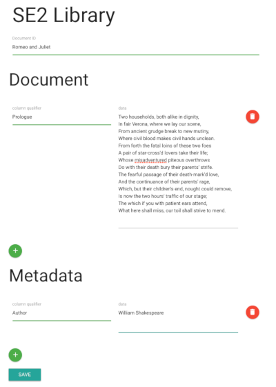
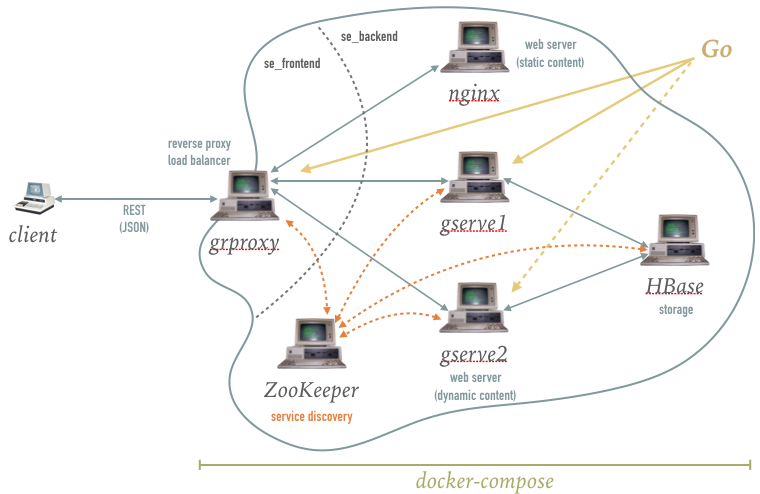

.. |output| image:: ./image/output.png
   :alt: Sample Output




Systems Engineering 2 - Assignment 1
====================================

Organization
------------

* **Hard deadline: 20.12.2020** 
* You have to fork this repository and adapt the code in your forked repository.
* Your solution will be tested at least three times per week in the time before the deadline.
* If your solution fails one or multiple tests, you will *not* receive a detailed explanation of the reasons why it failed.
* Your task is to figure it out on your own. However, we will provide information about the current state of your solution.
* The results of these intermediate tests are not graded. Only the final result matters.
* We will finally evaluate all repositories on *20.12.2020*.
* Usage of Git is mandatory (multiple commits with meaningful messages)
* GO is mandatory
* You have to work alone
* Don't share code, if so you will immediately fail the assignment.
* Ask questions in the `Auditorium <https://auditorium.inf.tu-dresden.de/en/groups/110631002>`_

Task description
----------------

Users of an online **document library** are presented with an input form, where they can submit *documents*
(e.g., books, poems, recipes) along with *metadata* (e.g., author, mime type, ISBN).
For the sake of simplicity, they can view *all* stored documents on a single page.

+------------+---------------+
| Input form | Output sample |
+------------+---------------+
| |form|     | |output|      |
+------------+---------------+

You are required to develop the online **document library** consisting of multiple services that are partially already existing.
For some services you will have to write Dockerfiles while for other services you will have to write code.
The complete project is setup using individual Dockerfile and Docker-Compose to start the services.
Hence, you are to create an application with the following architecture.

+----------------+
| |architecture| |
+----------------+

Don't worry, in this repository you can find some Makefiles, Dockerfiles, configuration files and source code to get you started.

Aspects that you need to learn to succeed
-----------------------------------------

* How to use Git
* What is Docker, how does it work
* How to write Dockerfiles
* What is Docker-Compose and how does it work
* How to write Docker-Compose files
* How to setup networks in Docker
* How to mount volumes in Dockerfile
* Programming in Go
* Fundamental knowledge of Hbase, ZooKeeper, and REST


Links
-----

* `Docker Docs <https://docs.docker.com/>`_
* `Docker Compose getting started <https://docs.docker.com/compose/gettingstarted/>`_
* `Docker Compose file reference <https://docs.docker.com/compose/compose-file/>`_
* `Apache HBase Reference Guide <http://hbase.apache.org/book.html>`_
* `ZooKeeper Documentation <http://zookeeper.apache.org/doc/trunk/>`_
* `Go Documentation <https://golang.org/doc/>`_
* `Pro Git <https://git-scm.com/book/en/v2>`_

Prerequisites
-------------

* Ensure that you have git installed
* Write, compile and run a simple ```hello world``` program in Go
* Ensure that ```docker run hello-world``` works
* Complete the *Docker Compose getting started* tutorial
* Fork this repository


Components
----------

In the following, the text provides an overview of the different components and the respective tasks that you have to fulfill.

Nginx
~~~~~

Nginx is a web server that delivers static content in our architecture.
Static content comprises the landing page (index.html), JavaScript, css and font files located in ``nginx/www``.

1. Edit and complete the ``nginx/Dockerfile``

   a) Upgrade the system
   #) Install nginx
   #) Copy ``nginx/nginx.conf`` from host to container's ``/etc/nginx/nginx.conf``
   #) Use port 80 in the container
   #) Run nginx on container startup

#. Edit the central docker-compose file

   a) Build the image using the Dockerfile for nginx
   #) Assign nginx to the ``se_backend`` network
   #) Mount the host directory ``nginx/www`` to ``/var/www/nginx`` in the container

#. Verify your setup (it should display the landing page)

HBase
~~~~~

We use HBase, the open source implementation of Bigtable, as database.
``hbase/hbase_init.txt`` creates the ``se2`` namespace and a ``library`` table with two column families: ``document`` and ``metadata``.

1. Build the docker image for the Dockerfile located in ``hbase/``
#. Edit the docker-compose file
   
   * Add hbase to the ``se_backend`` network

#. Start the hbase container to test it and to familiarize yourself with HBase:

   * The Container exposes different ports for different APIs.
   * We recommend to use the JSON REST API, but choose whatever API suits you best.
   * `HBase REST documentation <http://hbase.apache.org/book.html#_rest>`_
   * The client port for REST is 8080
   * Use Curl to explore the API
      * ``curl -vi -X PUT -H "Content-Type: application/json" -d '<json row description>' "localhost:8080/se2:library/fakerow"``
      * yes, it's really *fakerow*
   
ZooKeeper
~~~~~~~~~

Deviating from the architecture image, you don't need to create an extra ZooKeeper container.
**The HBase image above already contains a ZooKeeper instance.**

1. Add an alias to the hbase section in the docker-compose file such that other containers can connect to it by referring to the name ``zookeeper``


Grproxy
~~~~~~~

This is the first service/server you have to write by yourself.
Implement a reverse proxy that forwards every request to nginx, except those with a "library" prefix in the path (e.g., ``http://host/library``).
Discover running gserve instances with the help of teh ZooKeeper service and forward ``library`` requests in circular order among those instances (Round Robin).

1. Implement the reverse proxy in *grproxy/src/grproxy/grproxy.go*
#. Edit and complete ``grproxy/Dockerfile``
#. In the docker-compose file:

   a) Build the grproxy container image
   #) Add grproxy to both networks: ``se_frontend`` and ``se_backend``


* You are allowed to use `httputil.ReverseProxy <https://golang.org/pkg/net/http/httputil/>`_
* You don't need to handle the case where an instance registered to ZooKeeper doesn't reply
* You are allowed to use the `go-zookeeper <https://github.com/samuel/go-zookeeper>`_ library


Gserve
~~~~~~

Gserve is the second service you need to implement, and it serves two purposes.
Firstly, it receives ``POST`` requests from the client (via grproxy) and adds or alters rows in HBase.
And secondly, it replies to ``GET`` requests with an HTML page displaying the contents of the whole document library.
It only receives requests from grproxy after it subscribed to ZooKeeper, and automatically unsubscribes from ZooKeeper if it shuts down or crashes.

1. Gserve shall return all versions of HBase cells (see output sample above)
#. The returned HTML page **has to** contain the string *"proudly served by gserve1"* (or gserve2, ...) without HTML tags in between
#. Edit and complete ``gserve/Dockerfile``
#. In the docker-compose file

   a) Build the gserve container
   #) Start two instances *gserve1* and *gserve2*
   #) Add both instances to the ``se_backend`` network
   #) Make sure, that both instances start after hbase and grproxy
   #) Provide the names of the instances (gserve1, gserve2) via environment variables

* For interacting with Hbase/ZooKeeper:
   * ``gserve/src/gserve/HbaseJSON.go`` contains helpers to convert data from frontend JSON via Go types to base64-encoded HBase JSON and back
   * You might want to use the (Un)marshal functions from the `encoding/JSON package <https://golang.org/pkg/encoding/json/>`_
   * You are allowed to use the `go-zookeeper <https://github.com/samuel/go-zookeeper>`_ library


Hints
-----

* Start small, don't try to solve every problem at once.
* Test your components against single Docker containers (e.g., gserve with HBase container), and integrate them into docker-compose later on.
* The developer tools of your browser may help you to capture and analyse requests and responses.


Git
---

* Push changes to *your* repo *regularely*
* If you find bugs in provided files or the documentation, feel free to create an issue and create a pull request.

Frequently Asked Questions
--------------------------

1. How do I use the JSON/Base64-encoding/(Un)Marshaling code?

   .. code:: go

     package main

     import "encoding/json"

     func main() {
     	// unencoded JSON bytes from landing page
     	// note: quotation marks need to be escaped with backslashes within Go strings: " -> \"
     	unencodedJSON := []byte("{\"Row\":[{\"key\":\"My first document\",\"Cell\":[{\"column\":\"document:Chapter 1\",\"$\":\"value:Once upon a time...\"},{\"column\":\"metadata:Author\",\"$\":\"value:The incredible me!\"}]}]}")
     	// convert JSON to Go objects
     	var unencodedRows RowsType
     	json.Unmarshal(unencodedJSON, &unencodedRows)
     	// encode fields in Go objects
     	encodedRows := unencodedRows.encode()
     	// convert encoded Go objects to JSON
     	encodedJSON, _ := json.Marshal(encodedRows)

     	println("unencoded:", string(unencodedJSON))
     	println("encoded:", string(encodedJSON))
     }

     /*
     output:

     unencoded: {"Row":[{"key":"My first document","Cell":[{"column":"document:Chapter 1","$":"value:Once upon a time..."},{"column":"metadata:Author","$":"value:The incredible me!"}]}]}
     encoded: {"Row":[{"key":"TXkgZmlyc3QgZG9jdW1lbnQ=","Cell":[{"column":"ZG9jdW1lbnQ6Q2hhcHRlciAx","$":"dmFsdWU6T25jZSB1cG9uIGEgdGltZS4uLg=="},{"column":"bWV0YWRhdGE6QXV0aG9y","$":"dmFsdWU6VGhlIGluY3JlZGlibGUgbWUh"}]}]}
     */

#. Do I need a library to connect with HBase?

   No, we recommend the REST interface. You might also consider using Thrift, but we haven't tested it.

#. Could you provide an example for an HBase scanner?

   Yes, for the command line:

   .. code:: bash

     #!/usr/bin/bash

     echo "get scanner"

     scanner=`curl -si -X PUT \
     	-H "Accept: text/plain" \
     	-H "Content-Type: text/xml" \
     	-d '<Scanner batch="10"/>' \
     	"http://127.0.0.1:8080/se2:library/scanner/" | grep Location | sed "s/Location: //" | sed "s/\r//"`

     echo $scanner

     curl -si -H "Accept: application/json" "${scanner}"

     echo "delete scanner"

     curl -si -X DELETE -H "Accept: text/plain" "${scanner}"

#. What is meant by "build gserve"?

   Build the docker image with docker compose, **not** the gserve binary.

#. HBase build is broken

   Unfortunately, HBase does not maintain a stable URL to the latest version of the software and we have to periodically migrate to newer versions.

   Try changing the variable HBASE_VERSION in hbase/Dockerfile to a more recent version. You can find a list of available versions here: http://apache.lauf-forum.at/hbase/stable/

   Also, see this discussion on Auditorium: https://auditorium.inf.tu-dresden.de/en/questions/4075
   

Optional
--------

You had a lot of fun and want more?
No problem!
Select a topic you're interested in, and enhance any of the components.
For instance, query single documents or rows, replace nginx with a web server written by yourself, improve the error handling in Grproxy, write test cases or in the worst case just beautify the HTML/CSS.
But keep in mind: your application *has to conform to the task description*.

Hint
----

* To fulfill this assignment you need to at least adapt one docker-compose file, four Dockerfiles, and two Go files.
* The system always tries to execute *docker-compose up*, ensure that this always succeeds.